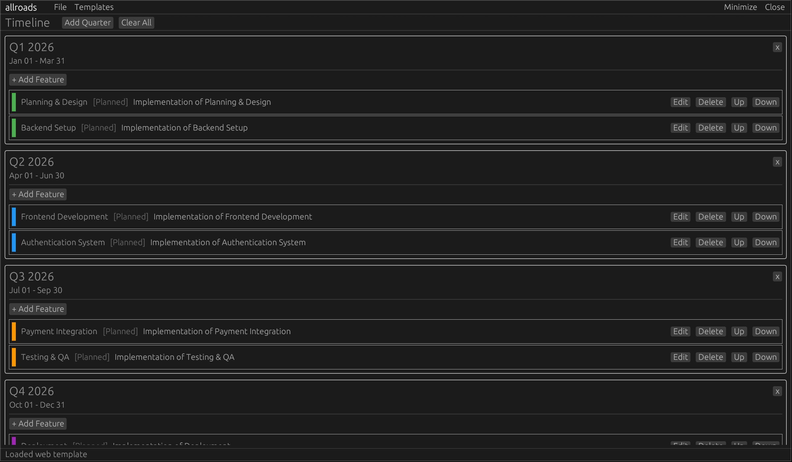

---
# allroads

latest working version. 
<br/>
<sup>now rewritten in rust.</sup>

### features:
- quarterly roadmap tracking. add and remove quarters as needed
- color coded tasks/features with descriptions
- new timeline view to help visualize project
- 4 stages of development (planned, developing, testing, and completed)
- unified sqlite3 roadmap storage with optional AES database encryption
- option to store database encryption key in keychain
- move tasks up and down, and between quarters
- completely redone, clean, rust based ui

### coming soon:
- **statistics:**
  - keep, view, and graph productivity stats

- **synchronization and organizations:**
  - build/join organizational charts
  - assign tasks to users 
  - uses simple token-based access

- **model context protocol:**
  - enable LLM interaction with allroads
  - AIs will be able to join organizations
  - assign tasks to agents and view outcomes

### compiling:
```
cd allroads && cargo build --release
```
