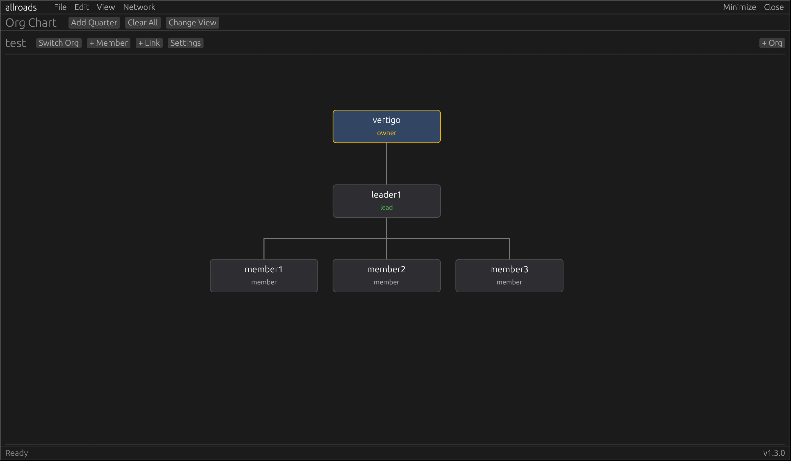

---
# allroads

latest working version. 
<br/>
<sup>now rewritten in rust.</sup>

### features:
- quarterly roadmap tracking. add and remove quarters as needed
- color coded tasks/features with descriptions
- timeline view to help visualize project
- 4 stages of development (planned, developing, testing, and completed)
- new org chart view to visualize organizations and task assignment
  - hierarchical view (only leaders can assign to subordinates)
  - non-hierarchical view (anyone can assign tasks to anyone)
- unified sqlite3 roadmap storage with optional AES database encryption
- option to store database encryption key in keychain
- move tasks up and down, and between quarters
- completely redone, clean, rust based ui
- **networking:**
  - join organizational charts and sync between team members
  - assign tasks and be assigned tasks
  - collaborate and track large-scale team projects
  - use simple token-based access

### coming soon:
- **statistics:**
  - keep, view, and graph productivity stats

- **model context protocol:**
  - enable LLM interaction with allroads
  - AIs will be able to join organizations
  - assign tasks to agents and view outcomes
  - agents can be assigned "leader" role and manage a human team

### compiling:
```
cd allroads && cargo +nightly build --release
```
<sup>requires rust nightly for rusqlite 0.40</sup>
